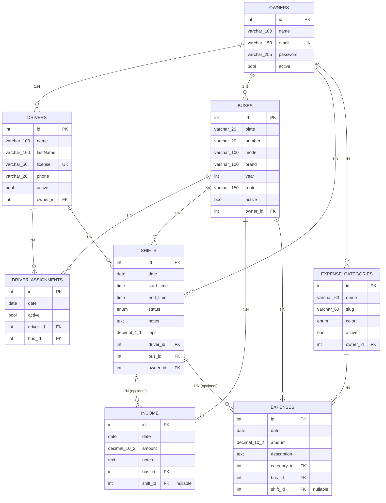

# Route Control — Database Schema

Postgres, managed with TypeORM migrations (`synchronize` is off — see `database/migrations/`).
8 tables in the `public` schema, all rooted at `owners` (multi-tenant by `owner_id`).

## Entity-relationship diagram

## Design notes

**Multi-tenancy by `owner_id`.** No schema/DB-per-tenant split — `owners` is the root and
everything hangs off it, either directly (`drivers`, `buses`, `shifts`,
`expense_categories`) or transitively (`income`/`expenses` inherit their owner through
`bus_id`; `driver_assignments` through `driver_id`/`bus_id`). No query should ever cross
owners.

**Constraints enforced by the database itself:**
- `owners.email` — `UNIQUE`
- `drivers.license` — `UNIQUE` (global, not scoped per owner)
- `expense_categories (owner_id, slug)` — unique composite index
- `shifts.laps` — `CHECK` (`NULL`, or a multiple of 0.5 and `>= 0`)
- Every FK is `ON DELETE NO ACTION` — nothing cascades. The soft-delete pattern on
  `buses`/`drivers`/`expense_categories` (`active = false` instead of a real `DELETE`)
  exists precisely to avoid ever hitting this.

**Rules that exist only in the application layer (not the database):**
- Uniqueness of `buses.plate` per owner — enforced in `BusesService.create`/`update`,
  there is no `UNIQUE` constraint on the column.
- "One `income` record per bus per day" — documented in `API.md`, but not actually
  enforced anywhere in `IncomeService.create`, nor by a DB constraint. This is a known
  gap, not yet fixed.

**Notable optional relationships:** `income.shift_id` and `expenses.shift_id` are
nullable — an income/expense record can stand alone or be linked to an open shift.
